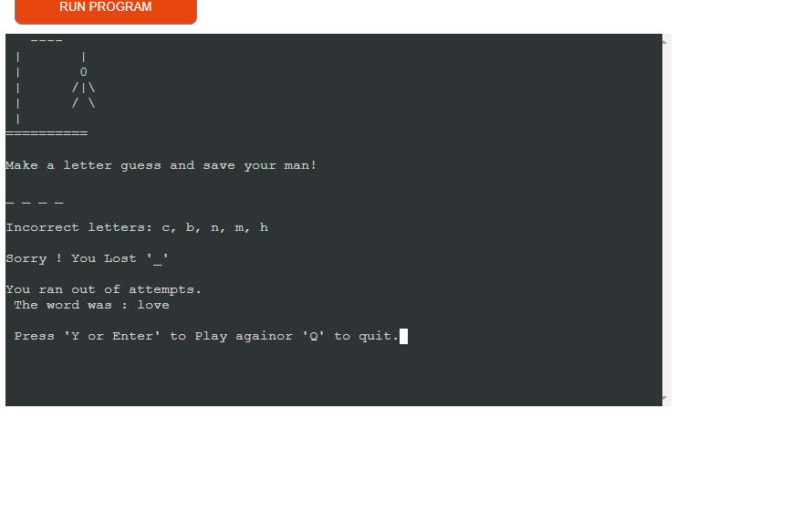

# Hangman
## Introduction

[Hangman](https://github.com/syricano/hangman) is a website for the classical hangman game that can be played online. It can be played [here](https://hangmann.onrender.com/)

## Technologies used
- [python](https://www.python.org/) the programming language used to create this game.
- [VScode](https://code.visualstudio.com/) was the editor used to write my codes.
- [Lucidchart](https://lucid.app/lucidchart/fa9b2743-5bf5-4d84-9b61-a6478f78a67f/edit?viewport_loc=-634%2C-65%2C2466%2C1223%2C0_0&invitationId=inv_c279b1c0-6d04-4edb-acc5-1f045c1c60c4)

### User stories:

1- As a player, I want to be able to select a difficulty level (easy, moderate, difficult) at the beginning of the game so that I can choose the level of challenge I prefer.
2- As a player, I want to see a visual representation of the hangman as I make incorrect guesses, so I can track my progress and avoid losing.
3- As a player, I want to be able to see the incorrect letters I've guessed so far, so I can avoid repeating them.
4- As a player, I want to see the current status of the word I'm trying to guess, with blanks for letters I haven't guessed yet, so I can better guess the word.
5- As a player, I want to know if my guess is correct and see the updated word if I guessed correctly, so I can continue making progress.
6- As a player, I want to know if my guess is incorrect and see the hangman drawing progress if I guessed wrong, so I can keep track of my remaining attempts.
7- As a player, I want to be informed  if I win the game by correctly guessing the word, so I can celebrate my victory.
8- As a player, I want to be notified if I lose the game by running out of attempts, so I can see the correct word and decide to play again.
9- As a player, I want the option to play the game again after either winning or losing, so I can continue playing without restarting the program.
10- As a player, I want to access the game rules to understand how to play, so I can learn or refresh my knowledge of the game.
11- As a player, I want to have the option to quit the game if I decide to exit, so I can gracefully exit the program.
12- As a developer, I want to deploy the game to Heroku with the necessary build packs so that players can access it online.

---

#### Planning:
1- Adding 3 lists of words , each lists can be used for difficulty choice of  user ( easy, moderate, difficult) lists of words.
2- select one word of the list randomly. and declare attempts
3- add input difficulty selection
4- ask player to make an input letters
5- validate the input to be a a letter , convert input to a str
6- creating a function to check the letter if included in the secret word or if user input the whole letters of word
update the word index values if the input is correct 
if the input is incorrect to reduce attempts
7- create a function to represent the current status of guessing word or incorrect attempt 
( mainly drawing hangman symbols/character)
8- creating a function to check if user guessed the word to declare he winned
and ending the game, also if he lose
9 - added a function to allow user select difficulty which will be used to pick up the long words
in case of higher difficulty
10- wrapped game function into main function to include main page menu
11 - writing game rules.
12 - deploy the game to render.

#### Design
Hangman is designed with few keyboard characters to shape head, arms, body, legs each part symbolize 1 attempts of total 6 max attempts for user input.

##### Flow Chart
A flow chart was made through lucid to plan the steps and structure of the game (https://lucid.app/lucidchart/fa9b2743-5bf5-4d84-9b61-a6478f78a67f/edit?viewport_loc=-634%2C-65%2C2466%2C1223%2C0_0&invitationId=inv_c279b1c0-6d04-4edb-acc5-1f045c1c60c4) 

# Features

## Welcome Page

- The main page has 3 navigation menu option for user to interact and choose to play or view rules or quit.

### Rules

- list of rules for player to read and can make a selection to press enter or Y to play or Q to quit

#### Play Game
- at the top a welcome message to player
then an option for play to select difficulty using arrow key boards , with pointer to current selection.
each selection is linked to a list of words.
easy mode with words for only 3 to 4 letters.
moderate with words of 5 or 6 letters.
difficult with words of 7 or more letters.

# Game Cycle or loop
The user is prompt to guess a letter or word with S number of letters displayed on the terminal.
- for every correct guessed letter, the game functionality append his selected letter in the right secret word index. finally if guessed word completed , the game congratulate the player and prompt to play again by pressing Y or enter, or Q to quite.
- for every incorrect letter, the game append his input in another display letters list, and start drawing one part of hangman 6 body one for each incorrect letter until user reaches the max attempts of 6 then the game declare the right word and he ran out of attempts.
then the game prompt user to press Y or enter to play again or Q to quite.

# Testing

- I tested the game through IC Python Linter until I cleared all errors or warnings 
 

- I also tested the page through Chrome lighthouse and i got positive result of 97% accessibility 70% performance

-
# Manual Testing 
# Testing Description    Expected Action           Actual Output
- Main Page Load       Game loads with menu          confirmed
- Rules            Rules is accessed by <up,down>    confirmed 
- Quite             Quite option works               confirmed
- Welcome message       Welcome message prints       confirmed
- select DIF        prompt user to select DIF        confirmed  
- incorrect L      list incorrect L in list          confirmed
- Draw hangman      Draw hangman by incorrect L      confirmed
- Attempts          Draw attempts -1                 confirmed
- Correct           List correct L in display        confirmed
- win               Declare winning                  confirmed
- Game over         Ran out                          confirmed
- display word      correct word display             confirmed
- Play again        play again                       confirmed

# Bugs

## Solved
- conflict between function name selection_difficulty and variable selected_difficulty
resolved by rename the function

- game when running an error occur due to missing () for lowercase of guess word.
it was resolved by adding () in target function

- a bug found that nothing print when the word is guessed
it was resolved by assigning variable to guessed word and comparing it with word to guess (secret word)

- a bug found in rules, it did not quite when selecting q, 

resolved adding the forgotten parentheses 

## Unsolved bugs 
None

# Deployment
* This Site was deployed by completing the following steps:

1. Creating new account and login to [Render](https://dashboard.render.com/).
2. on Dashboard click on New + then select Web Service
3. Select the GitHub option and connect the application to the repository you created.
4. Search for the repository you created and click "Connect."
5. Create unique name for the application , mine selected hangmann.
6. Select the region where you want to deploy the application.Mine selected Frankfurt EU
7. Select branch to deploy.
8. Select environment.
9. Render build command: pip3 install -r requirements.txt && npm install.
10. Render start command: node index.js.
11. Select Free plan.
12. Click on "Advanced" settings.
13. Add the following environment variables:
Key: PORT Value: 8000
Key: PYTHON_VERSION Value: 3.10.7
14. Click "Create Web Service."
15. Wait for the completion of the deployment.

# Credits

 None
 